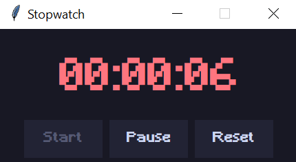
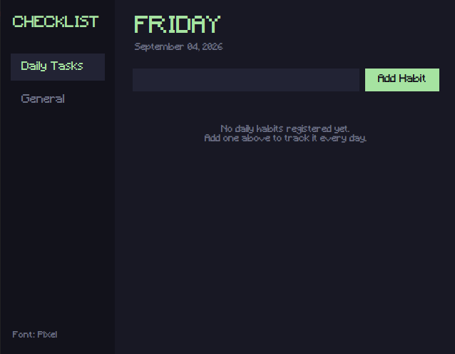

# Some Python Projects '-'

A collection of simple Python utilities, automation scripts, and small GUI applications designed to be functional and easy to use. Most of them was built in a day or less.

---

## 📑 Table of Contents

- [Overview](#-overview)
- [Projects](#projects)
  - [Scripts](#scripts)
    - [File Sorter](#file-sorter)
    - [Password Generator](#password-generator)
    - [Pomodoro Timer](#pomodoro-timer)
    - [Decision Roulette](#decision-roulette)
  - [GUI Apps](#graphical-user-interface-apps)
    - [Stopwatch](#stopwatch)
    - [Checklist App](#checklist-app)
    - [Color Picker](#color-picker-section)

##  📋 Overview

| Project | Category | Tech / Libraries | Description |
| :--- | :--- | :--- | :--- |
| `file_sorter` | Script / Automation | `pathlib`, `shutil`, `argparse` | Organizes directory files by category with collision handling and undo support. |
| `password_generator` | Script / Security | `secrets`, `string` | Generates cryptographically secure passwords with custom character rules. |
| `pomodoro_timer` | Script / Productivity | `time` | Interactive Pomodoro timer with real-time CLI progress bars and audio alerts. |
| `decision_roulette` | Script / Utility | `secrets`, `time` | A marquee-style animated decision roulette with realistic deceleration. |
| `stopwatch` | Desktop GUI | `tkinter` | A clean stopwatch with pause and reset controls. |
| `checklist` | Desktop GUI | `tkinter`, `json`, `datetime` | A minimalist checklist with persistent backlog, habit midnight reset, and dynamic typography toggling. |
| `color_picker` | Desktop GUI / Tool | `tkinter`, `pillow` | Modular pixel inspector and automated palette generator. Decoupled to standalone repository. |
---
<a name="projects"></a>
## 🛠️ Projects

### Scripts

#### <ins>File Sorter</ins>
A lightweight automation tool that organizes files in a directory into categorized folders based on their extensions. It prevents overwriting through collision resolution, generates a local history log, and allows rolling back changes.

* **Location:** `scripts/file_sorter.py`
* **Dependencies:** None (Standard Library only: Python 3.8+)

**Features:**
* Categorizes files into `Images`, `Documents`, `Audio`, `Video`, `Compressed`, `Installers`, and `Code`.
* Automatic collision handling (e.g., renames duplicates to `file(1).ext`).
* Rollback system to revert moves and remove empty folders.
* Interactive menu on double-click or CLI command support.

**Usage:**

You can simply place `file_sorter.py` inside the folder you want to organize and double-click it. 

If you prefer or find it more convenient, you can also run it directly from your terminal using these commands:

* **Organize the current folder:**
  ```bash
  python file_sorter.py
  ```
  
* **Organize a specific folder without moving the script:**

  ```bash
  python file_sorter.py "path/to/target/folder"
  ```

* **Undo the last organization:**

  ```bash
  python file_sorter.py --undo
  python file_sorter.py "path/to/target/folder" --undo
  ```

* **Delete the history log (Lock changes permanently):**

  ```bash
  python file_sorter.py --clear-history
  ```

#### <ins>Password Generator</ins>

Generates cryptographically secure random passwords. It features custom length and character set selection. 

* **Location:** `scripts/password_gen.py`
* **Dependencies:** None (Standard Library only: Python 3.8+)

**Features:**

* Cryptographically secure randomness powered by Python's `secrets` module.
* Guarantees at least one character of each selected type (uppercase, digits, symbols) to meet standard password policy requirements.
* Configurable password length and character sets.
* Support for generating single or multiple passwords in a single run.
* Interactive step-by-step CLI interface with strict input validation.

**Usage:**

You can simply double-click `password_gen.py` or run it directly from your terminal:

* **Run the interactive generator:**
  ```bash
  python password_gen.py
  ```

#### <ins>Pomodoro Timer</ins>

A simple CLI timer to help you keep focused, with clean progress bars and work/break sessions.

* **Location:** `scripts/pomodoro_timer.py`
* **Dependencies:** None (Standard Library only: Python 3.8+)

**Features:**

* Real-time animated progress bar right in your terminal.
* Quick presets (25/5 min, 15/3 min) or custom study/break times.
* System sound alert when your time is up.
* Quick cancel anytime by pressing `Ctrl + C`.
* Easy defaults: just press Enter to start.

**Usage:**

You can simply double-click `pomodoro_timer.py` or run it directly from your terminal:

* **Run the interactive generator:**
  ```bash
  python pomodoro_timer.py

#### <ins>Decision Roulette</ins>

A simple CLI decision-maker that spins through your choices with fair random picks.

* **Location:** `scripts/decision_roulette.py`
* **Dependencies:** None (Standard Library only: Python 3.8+)

**Features:**

* Animated marquee frame that slows down naturally to pick a winner.
* Unbiased random selection powered by `secrets`.
* Custom options support

**Usage:**

Double-click `decision_wheel.py` or run:

```bash
  python decision_wheel.py
```

---
### Graphical User Interface Apps

#### <ins>Stopwatch</ins>

A tiny-simple stopwatch built mainly to learn how to use the tkinter library

* **Location:** `gui_apps/stopwatch/stopwatch.pyw`
* **Dependencies:** None (Python Standard Library: `tkinter`)
* **Assets:** `gui_apps/fonts/Minecraft.ttf` *(install this font first if you want the pixel-art look, otherwise it just defaults to your system font)*

**Screenshot:**



**Features:**

* Dark theme
* Pixel-art font display.
* Classic `HH:MM:SS` formatted digital time display.
* Dynamic button state management to prevent duplicate timers.
* Non-blocking updates using `root.after`.

**Usage:**

Run directly doing double-click on `stopwatch.pyw` or run it in your terminal:

```bash
pythonw gui_apps/stopwatch/stopwatch.pyw
```

#### <ins>Checklist App</ins>

A lightweight, desktop task manager featuring a dark theme, pastel green accents, and a modular architecture.

* **Location:** `gui_apps/checklist/checklist_main.pyw`
* **Dependencies:** None (Python Standard Library: `tkinter`, `json`, `datetime`, `ctypes`)
* **Assets:** `gui_apps/fonts/Minecraft.ttf` *(install this font first for the pixel-art look, otherwise it falls back to your system font)*

**Screenshot:**



**Features:**

* **Dual-View System**: Separate panels for **Daily Tasks** (recurring daily habits) and **General Backlog** (persistent to-do list).
* **Automatic Midnight Reset**: Tracks the current date and automatically clears daily checkmarks when a new day begins.
* **Dynamic Typography Toggle**: Discrete bottom-left button to switch between modern (`Segoe UI`) and retro pixel-art (`Minecraft`) modes.
* **Persistent Preferences**: Saves tasks, states, and the last selected font mode automatically in a local `tasks.json`.
* **Modular Architecture**: Separated into dedicated modules for configuration (`config.py`), data logic (`task_manager.py`), and views (`views/`).

**Usage:**

> **Note:** Keep the entire `checklist/` folder structure intact (`config.py`, `task_manager.py`, `views/`, and `fonts/`), as the application relies on these modular components and relative imports to run.

Run directly with a double-click on `checklist_main.pyw` or run it from your terminal:

```bash
pythonw gui_apps/checklist/checklist_main.pyw
```

*(Optional) Desktop Shortcut: Double-click create_shortcut.bat to automatically generate a Desktop shortcut pre-configured with its custom icon and correct working directory.*
<a name="color-picker-section"></a>
### 🎨 [Color Picker](https://github.com/raysandzzz/color-picker-desktop)

A modular desktop application built with Python and Tkinter for pixel-level color inspection and palette extraction from images. Includes standalone Windows executable support.

* **Tech Stack:** Python 3, Tkinter, Pillow, PyInstaller
* **Repository:** [raysandzzz/color-picker-desktop](https://github.com/raysandzzz/color-picker-desktop)

## Screenshots

<div align="center">
  <p><strong>Main Workspace</strong></p>
  
</div>
